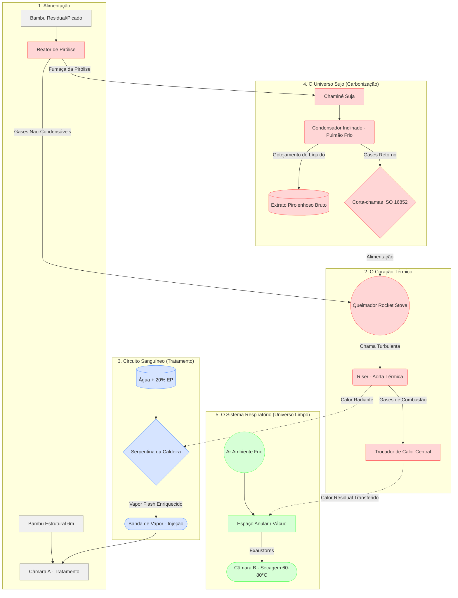

# Relatório de Viabilidade Técnica: Biorrefinaria T02 (Advocacy 5.1)

**Especialidade:** Engenharia Industrial | Termodinâmica | Reatores de Pirólise
**Contexto:** Plataforma Amazônia Regenerativa — Núcleo Takwara

O sistema T02 é uma unidade descentralizada de cascateamento térmico que opera em três circuitos integrados: Carbonização, Tratamento Químico-Vapor e Secagem Térmica.

## 1. Organograma Metabólico: Fluxo do Processo (Mapa Mental)

O diagrama abaixo ilustra a anatomia do sistema e o cascateamento térmico, desde a ignição até a condensação e secagem do "Universo Limpo".

---

## 2. Anatomia Sequencial do Sistema (Retrato Falado Direcional)

Para visualizar o funcionamento do sistema T02, acompanhemos o ciclo de vida de uma batelada:

### Passo 1: O "Engolir" Inicial e o Despertar Térmico (Reator de Pirólise e Rocket Stove)
O ciclo vital se inicia no abastecimento térmico da usina. Carrega-se o **Reator de Pirólise (Carbonização)** — uma câmara retorta primária — estritamente com biomassa residual (galhadas, tocos, aparas). Este reator é selado fisicamente. Posicionado fora do ventre do reator principal, **na extremidade do sistema condensador**, fica o **Rocket Stove** (o coração). Como no início ainda não há fumaça residual combustível (Gases Não-Condensáveis), o Rocket Stove é alimentado manualmente com lenha fina "de partida". Essa primeira fogueira é o "despertar". A chama feroz sobe pelo tubo vertical isolado: o **Riser**. A brutal tiragem natural do Riser cria um fluxo convectivo (0 barg) pelo sistema de jaquetas, impelindo ar quente para o processamento.

### Passo 2: O Cordão Umbilical e a Flash-Vaporização (Serpentina e Pulso d'água)
Enrolada exteriormente à incandescência do Riser, jaz a **Caldeira (Serpentina)** de aço SCH 80. A alimentação hídrica não demanda bombas elétricas sujeitas a falhas em campo: um **tanque de carga suspenso a 3 metros de altura** injeta por estrita pressão gravitacional controlada por válvula-agulha uma maceração (80% água / 20% Extrato Pirolenhoso) na boca da serpentina. A água desce gelada e "choca-se" contra a base ardente do Riser, sendo vaporizada quase instantaneamente (efeito *Flash*). O "Vapor Químico" viaja sob pressão volumétrica crescente pela tubulação termo-blindada ascendente.

### Passo 3: O Banho Fitossanitário (Câmara A - Tratamento)
Enquanto a pirólise ruge, as Câmaras Gêmeas de 6m (que engoliram silenciosamente até 2 toneladas de varas longas de bambu pela manhã) estão prontas. O vapor químico chuta o bocal (**Banda de Vapor**) da **Câmara A**, precipitando-se na cúpula de aço inox. *Diferencial Cirúrgico*: As câmaras estruturais não atuam sob estresse de autoclaves de caldeira (altos bars), operam quase à **Pressão Atmosférica**. O bambu é oco. A fumaça d'água adentra facilmente os diafragmas nodais pré-perfurados e viaja pelos xilemas via capilaridade térmica profunda, cozinhando amidos sem risco de despressurização letal.

### Passo 4: O Exalar e o "Universo Sujo" (Pirólise Residual)
Enquanto a madeira residual de sacrifício carboniza no Reator de Pirólise, fumaças densas de voláteis alçam voo para a **Chaminé Fria**. Essa é a única rota de fuga da pirólise.

### Passo 5: O Pulmão de Vida ou Morte e a Reciclagem (Condensador e Corta-Chamas)
Essa grossa tubulação do Universo Sujo desce em inclinação de 10° a 30° banhada em contrafrio. O Extrato Pirolenhoso goteja no sifão de purga. Os gases que sobram (Metano, CO, H₂) voltam por um cano sob a máquina direto para o "Coração" (Rocket Stove), onde alimentarão a chama. Entre o condensador e o queimador repousa o **Corta-Chamas (ABNT ISO 16852)**, para obliterar um *Flashback* mortal no caso de tosse mecânica.

### Passo 6: A Capa Respiratória e o "Universo Limpo" (Câmara B - Secagem)
Terminado a exaustão do coração, o bafo quente de chama exausta cede seu calor a um invólucro (Jaqueta Anular). Nesse anel de ar protegido entre casco e isolante espesso atuam exaustores elétricos que induzem ar novo a circundar paredes ardentes, purificando-o (Vácuo Limpo). Um banco de **Termopares Tipo-K** repousa no Plenum apontando diretamente ao focinho da **Câmara B (Secagem)**—a outra câmara de 6m carregada com o lote da "colheita estrutural de ontem". Se passar de 80ºC, o cérebro eletrônico puxa ar ambiente mais frio. Ar límpido sopra ali dentro desidratando amidos sem fuligem. O Sistema devora o seu lixo florestal (no Reator) para imunizar e secar estruturalmente o "coração da safra gigante" (nas Câmaras 6m) em um ciclo infinito de devoração e purificação.

---

## 3. Informações Críticas da Cronobiologia

| Categoria | Descrição / Capacidade |
| :-- | :-- |
| **Tempo de Metabolismo** | 8 horas por cozedura total (Batelada) / 2 hrs secagem inicial; 4 hrs carbonização ativa; 2 hrs alívio passivo de purga. |
| **Autonomia da Caldeira**| O reservatório sustenta 4 metabolismos sucessivos (32 hrs contínuas). |
| **Rendimento Físico** | Extração Gravimétrica: Até 400kg de Biochar puro + 200 Litros de EP Concentrado / dia metabólico no Reator de Pirólise; + de 100 colmos estruturais (6m) imunizados/secos nas Câmaras Gêmeas. |

---

## 4. Bill of Materials (BoM) — Lista Detalhada por Elemento

Para a fabricação do maquinário, as especificações mecânicas exigem separação rigorosa de ligas metálicas devido ao gradiente de estresse térmico-químico:

1. **Reator de Pirólise (Corpo da Retorta Primária)**
   - **Chapa (Cilindro)**: Aço Carbono ASTM A36 — Espessura **1/4" (6.35 mm)** (Para suportar deformação térmica e dilatação cíclica em 600°C).
   - **Isolamento Externo**: Manta de fibra cerâmica silicato de alumina vulcanizada — **Densidade 128 kg/m³, espessura 50 mm**.
   - **Carenagem (Jaqueta final)**: Chapa de Alumínio Lisa ou Aço Galvanizado minimizado — **Espessura 0.8 mm (Nº 22)**.

2. **Câmaras Gêmeas de Tratamento (6.000 x 1.000 mm)**
   - **Câmara A (Vapor/EP Fitossanitário)**: 
     - Revestimento interno / Chapa de Contato: **Aço Inox AISI 304 — Espessura 2,0 mm a 3,0 mm**. Obrigatório devido ao pH de 2,5 do Extrato Pirolenhoso.
     - Parede Externa Estrutural: Aço Carbono ASTM A36 — Espessura 1/8" (3,17 mm), operando em pressão atmosférica.
   - **Câmara B (Secagem Universo Limpo)**:
     - Chapa Estrutural: Aço Carbono comum ou Galvanizado NBR 7008 — Espessura 2.0 mm (Chapa 14). Isenta de acidez, atua apenas com ar aquecido a 80°C.
   - **Flanges e Portas**: Anéis laminados em aço carbono **Espessura 1/2" (12.7 mm)** usinados a frio para não empenar as portas no fechamento.
   - **Gaxeta das Portas**: Perfil de silicone para alta temperatura ou cordão de fibra de vidro trançado (30 mm) envelopado com grafite flocado.

3. **Coração Térmico: Rocket Stove e Caldeira**
   - **Queimador e Riser**: Tubo Aço Carbono **SCH 80 (Sem Costura)**. Tolerância extrema a stress térmico contínuo.
   - **Isolamento do Riser**: Argamassa refratária de alta pureza (Alumina >60%) moldada fundida.
   - **Serpentina da Caldeira**: Tubo de Aço Inox AISI 316 (ou 304D) **Diâmetro 3/4" e Parede SCH 40**, para resistir não só à pressão do vapor flash mas à oxidação extrema no contato visual com as altas temperaturas do queimador.
   - **Válvulas (NR-13)**: Engates rápidos industriais "Camlock" de Inox 316 e selo Viton.

4. **Componentes Periféricos**
   - **Condensador Tubular (Chaminé Fria)**: Tubo Aço Inox 304, diâmetro mínimo de 150 mm, calandrado sem estrangulamento para fluxo denso.
   - **Sistema de Vácuo/Exaustor**: Motor blindado IP55 com hélice em alumínio não faiscante.
   - **Corta-Chamas**: Dispositivo Anti-Retorno de Chama operando por extinção de diâmetro de placa (*Crimped Ribbon*), em laudo de acordo a ISO 16852.

---

## 5. Diretrizes para Modelagem 3D e Renderização (IAs)

Para alimentar ferramentas gerativas (Midjourney, DALL-E, Stable Diffusion) ou servir de briefing visual rápido a ilustradores industriais, utilize os seguintes prompts arquitetados para obter a composição e atmosfera desejadas:

### 5.1 Prompt Mestre (Estilo Render Industrial / Steampunk Biológico)
> **Prompt em Inglês (Otimizado para LLMs e Geradores de Imagem):**
> *"Industrial isometric 3D render, highly detailed, photorealistic. A community biomass biorefinery plant in an Amazonian setting. On the right, two massive 6-meter-long horizontal cylindrical steel tanks stacked parallel, resembling brushed metal autoclaves with large round ship-like hatch doors and thick flanges. The top tank has a red metallic pipe (steam band) connected to its dome. On the lower left side, a stark, shorter, and much thicker vertical reactor (pyrolysis retort) rests on a masonry base with a visible dark horizontal funnel (Rocket Stove) glowing fiercely with orange fire inside. A shiny slanted steel pipe (condenser) cascades down from the thick reactor towards the ground, dripping dark green oil into a siphon. The overall aesthetic is clean brushed steel, precise industrial instrumentation, steampunk biological machinery, soft natural daylight piercing through a heavy canopy, Unreal Engine 5 render, sharp focus, 8k resolution."*

### 5.2 Estrutura de Atributos (Caso a IA peça variáveis)
- **Tema:** Equipamento de Engenharia Térmica Pesada (Biomassa).
- **Paleta de Cores:** Aço escovado prateado, fuligem mate no reator retorta, alvenaria terracota/preta no queimador de base, fumaça verde-esmeralda e brilhos de chamas laranja-azulado vivo no Riser.
- **Iluminação:** Luz Volumétrica (God rays) atravessando galpão rústico ou copa de árvores, destacando texturas de metal usinado e reflexos nos flanges.
- **Ângulo:** Isométrico 45° ou Perspectiva Três-Pontos, olhando ligeiramente de cima para evidenciar as chaminés.

---

## 6. Desenho Técnico Industrial: Vistas Necessárias

Para a entrega final da planta executiva do fabricante da caldeiraria, devem ser confeccionados:
- **Vista Superior (Planta Baixa)**: Evidenciando as fundações sapatas do Reator e os trilhos frontais em balanço das Câmaras Gêmeas.
- **Vista Frontal e Elevação**: Demarcando o nivelamento gravitacional que faz o líquido condensador do EP declinar perfeitamente (ângulo de 15 a 30° graus).
- **Cortes Transversais (Secção do Riser)**: É estritamente exigido um corte no ponto magnético H (Rocket Stove), demonstrando a serpentina embutida na parede do tubo, seu posicionamento de retorno diretamente ligado ao tubo inferior do Condensador, e a inserção lateral do Corta-Chama na interface de admissão de gases não-condensáveis.

---

## 7. Modelagem Termodinâmica em Aspen Plus (Parâmetros)

A prova definitiva de eficiência energética para a qualificação MRV verde requer uma simulação do balanço estacionário. Estes são os inputs processuais para a equipe de simulação rodar no DWSIM ou Aspen Plus:

- **Flowsheet Mestre**:
  1. *Subsistema Pirólise (Reator Yield)*:
     - Componente de Biomassa: Composição elemental de *Guadua weberbaueri* (Carbono 48%, Oxigênio 44%, Hidrogênio 6%).
     - Bloco *Ryield* definido em T=550°C, P=1 atm.
     - Partição: Sólidos = Biochar (Carvão base); Líquidos (Acetic acid, Phenol, Water); Gases (H2, CH4, CO, CO2).
  2. *Subsistema Rocket Stove (Combustão)*:
     - Bloco *RStoic / RGibbs*, alimentando oxidante (Ar excesso 10%) e as correntes gaseificadas de cima. T-saída > 850°C.
  3. *Subsistema Caldeira Serpentina (HeatX/Heater)*:
     - Trocador acoplado ao stream do *RGibbs*. Entrada H2O+Acético a 25°C, Saída a 120-150°C Vapor Flash T=(Saturado Atmosférico ou Leve Pressurizado à linha da Câmara A).
  4. *Subsistema Universo Limpo (Cooler / Fan)*:
     - Ar puxado do exterior (28°C), cruzando a jaqueta residual, saindo do trocador a *Target T=70°C*. 

**Objetivo de Convergência**: Demonstrar que o Q (Calor) irradiado do Rocket Stove (*duty*) é autossuficiente para vaporizar (H-vap) 20 Litros/h da água/composto e, simultaneamente, transferir U-h para a jaqueta anular alcançando a secagem de grandes volumes estruturais verdes na vizinhança T=60°C constante.

**🎋 Takwara — Soberania Técnica para a Justiça Social**

---

> **Citação Recomendada:**
> Takwara, F. R. (2026). *Relatório de Viabilidade Técnica: Biorrefinaria T02*. Plataforma Amazônia Regenerativa (Vol. 5.1). Zenodo. https://doi.org/10.5281/zenodo.14827106
